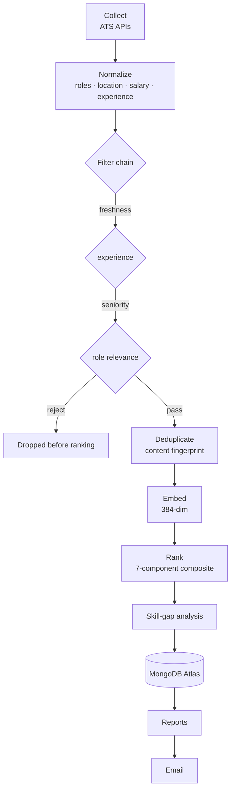

# Architecture

The AI Job Intelligence Agent follows **Clean / Hexagonal architecture (Ports &
Adapters)**. The domain is pure Python; every external dependency sits behind a
port and is wired at the edge via dependency injection.

## Principles

- **Domain isolation.** `app/core` (ranking, filters, dedup, normalization,
  skill-gap, classification) has no knowledge of Mongo, HTTP, or SMTP.
- **Ports & adapters.** Each external concern is an interface (port) with one or
  more swappable implementations (adapters).
- **Dependency injection.** The container in `app/api/deps.py` assembles adapters
  and injects them; nothing reaches out to a global.
- **Async-first.** All I/O is asynchronous (FastAPI + Motor + httpx).
- **Fail-fast configuration.** Settings are validated at startup
  (`app/config/settings.py`); e.g. ranking weights must sum to 1.0.

## Ports & adapters

| Port | Responsibility | Default adapter |
|---|---|---|
| `BaseCollector` | Fetch postings from a source | ATS plugins (`app/collectors/ats/`) |
| `JobFilter` | Accept/reject a job pre-ranking | freshness / experience / seniority / role |
| `EmbeddingProvider` | Text → vector | `sentence-transformers` (bge-small-en-v1.5) |
| `VectorScorer` | Similarity search | Atlas Vector Search / numpy |
| `BaseRepository` | Persistence | MongoDB / Motor |
| `Exporter` | Render a report | HTML / Excel / CSV / JSON / PDF |
| `Notifier` | Deliver a report | SMTP |

## Pipeline data flow

The filter chain runs **before** embedding — unsuitable roles never consume
embedding or ranking work, which keeps results relevant and costs low.

## Composite ranking score

The final score (0–100) is a weighted blend of seven components; the weights are
configurable and validated to sum to 1.0:

| Component | Default weight | Signal |
|---|---|---|
| Similarity | 0.34 | Semantic resume↔job cosine similarity |
| Skill | 0.24 | Technical-skill coverage |
| Experience | 0.14 | Fit against experience budget |
| Location | 0.10 | Location / work-mode match |
| Company priority | 0.10 | P1–P5 tier of the employer |
| Freshness | 0.03 | Recency of the posting |
| Quality | 0.05 | Posting completeness |

Each match carries per-component sub-scores plus a human-readable explanation.

## Persistence

MongoDB (Motor) via typed repositories in `app/db/repositories/`. Production
ranking uses **Atlas Vector Search** (`$vectorSearch`) on a 384-dim cosine index
over `jobs.embedding`; local/test runs use an in-process numpy scorer.

## Configuration & runtime overrides

Bootstrap config comes from environment variables. A versioned
`AppConfigDocument` in Mongo can override ranking weights, enabled collectors,
scheduler, and notification preferences at runtime without a redeploy
(`app/services/config_service.py`).

## Further reading

Subsystem deep-dives and architecture decision records live in
[`architecture/`](architecture/):

- `architecture/adr/` — ADR-001…005 (vector search, clean/hexagonal, ATS-over-scraping, Actions scheduler, Mongo-over-Postgres)
- `AI_ARCHITECTURE.md`, `EMBEDDING_PIPELINE.md`, `VECTOR_SEARCH.md`,
  `ATS_COLLECTORS.md`, `PIPELINE.md`, `REPORTING.md`, `MODEL_REGISTRY.md`,
  `EXTENSIBILITY.md`
