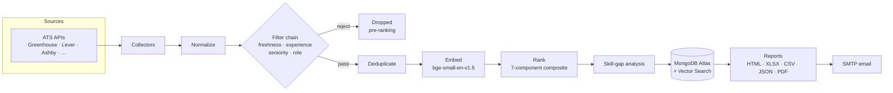

# AI Job Intelligence Agent

[](https://github.com/karthikjonnalagadda/Job-moniter/actions/workflows/ci.yml)
[](https://www.python.org/)
[](LICENSE)
[](https://github.com/astral-sh/ruff)
[](https://mypy-lang.org/)

Autonomous, AI-powered job discovery. It collects fresh postings from **official
career pages and ATS platforms**, normalizes and deduplicates them, filters out
roles that don't fit your profile **before** they ever reach the ranker, scores
the survivors against your resume with **semantic embeddings**, and emails you a
formatted report — on a daily schedule.

> **Status:** `v0.8.0` — production-ready core. Collection, normalization,
> filtering, semantic ranking, skill-gap analysis, multi-format reporting, and
> SMTP notification are all wired and tested. The FastAPI service exposes the
> full pipeline plus health/metrics probes.

---

## Table of contents

- [Features](#features)
- [Architecture](#architecture)
- [Requirements](#requirements)
- [Local setup](#local-setup)
- [Docker](#docker)
- [MongoDB Atlas setup](#mongodb-atlas-setup)
- [Configuration](#configuration)
- [Deployment](#deployment)
- [Testing & quality gates](#testing--quality-gates)
- [Project layout](#project-layout)
- [Documentation](#documentation)

---

## Features

- **Official-source collection** — pluggable ATS collectors (Greenhouse, Lever,
  SmartRecruiters, Ashby, Workday, and more). Never scrapes aggregators.
- **Pre-ranking filter chain** — freshness, experience, **seniority**, and
  **role-relevance** filters reject unsuitable roles *before* embedding, so the
  AI ranker only ever sees viable jobs.
- **Semantic ranking** — `BAAI/bge-small-en-v1.5` (384-dim) embeddings scored via
  MongoDB Atlas Vector Search, blended into a transparent 7-component composite.
- **Explainable matches** — every score carries per-component sub-scores and a
  human-readable narrative.
- **Skill-gap analysis** — technical-skill coverage plus a prioritized
  learning list.
- **Multi-format reporting** — HTML, Excel, CSV, JSON, and PDF exports.
- **Daily automation** — GitHub Actions cron runs the pipeline and emails results.
- **Clean / Hexagonal architecture** — every external dependency sits behind a
  port, so adapters are swappable and the domain is pure Python.

---

## Architecture

Clean / Hexagonal (Ports & Adapters). The domain (`app/core`) is pure Python and
knows nothing about Mongo, HTTP, or SMTP. Everything external is a swappable
adapter behind a port.



| Port (interface) | Default adapter | Location |
|---|---|---|
| `BaseCollector` | ATS / career-site plugins | `app/collectors/` |
| `EmbeddingProvider` | `BAAI/bge-small-en-v1.5` (384-dim) | `app/embeddings/` |
| `VectorScorer` | **Atlas Vector Search** (numpy for local/tests) | `app/vector/` |
| `JobFilter` | freshness / experience / seniority / role | `app/core/filters/` |
| `Notifier` | SMTP (Telegram/Slack-ready) | `app/notifications/` |
| `Exporter` | HTML / Excel / CSV / JSON / PDF | `app/exporters/` |
| `BaseRepository` | MongoDB / Motor | `app/db/repositories/` |

Daily flow: **collect → normalize → filter (freshness · experience · seniority ·
role) → deduplicate → embed → rank → skill-gap → store → report → email**.

See [ARCHITECTURE.md](ARCHITECTURE.md) and the ADRs in [`architecture/adr/`](architecture/adr/)
for the full design.

---

## Requirements

- Python **3.12+**
- A **MongoDB Atlas** cluster with **Vector Search** (M10+ recommended) for
  production ranking. Local dev can use plain MongoDB + the numpy scorer.
- Docker (optional, for the containerized workflow)

---

## Local setup

```bash
# 1. Clone
git clone https://github.com/karthikjonnalagadda/Job-moniter.git
cd Job-moniter

# 2. Create a virtualenv
python -m venv .venv
source .venv/bin/activate          # Windows: .venv\Scripts\Activate.ps1

# 3. Install (runtime + dev tooling; add ml for real embeddings)
pip install -e ".[dev]"
pip install -e ".[ml]"             # torch + sentence-transformers (optional)

# 4. Configure
cp .env.example .env               # then edit values (Mongo URI, SMTP, ...)

# 5. Run the API
uvicorn app.main:app --reload
```

Open <http://localhost:8000/docs> for the interactive API and
<http://localhost:8000/health> for the liveness probe.

### Local without Atlas

Set these in `.env` to run fully offline (uses the numpy scorer):

```
JOBAGENT_MONGO__URI=mongodb://localhost:27017
JOBAGENT_VECTOR__BACKEND=numpy
```

---

## Docker

```bash
# Full local stack (API + MongoDB), API on :8000
docker compose up --build

# Build just the lean API image
docker build -t job-agent-api .
docker run -p 8000:8000 --env-file .env job-agent-api
```

The compose stack sets `JOBAGENT_VECTOR__BACKEND=numpy` because local MongoDB has
no Vector Search. Point `JOBAGENT_MONGO__URI` at Atlas to exercise `$vectorSearch`.

---

## MongoDB Atlas setup

1. Create a cluster (M10+ for Vector Search).
2. Create a database user and network-access rule; copy the connection string
   into `JOBAGENT_MONGO__URI`.
3. Set `JOBAGENT_MONGO__DB_NAME=job_intelligence`.
4. The **vector search index** on `jobs.embedding` is defined in
   `app/db/indexes.py`. Create it via the bootstrap CLI (below) or manually in
   Atlas → Search → Create Index → JSON editor. Summary: 384 dims, `cosine`,
   filter fields `status`, `work_mode`, `location_tags`.

```bash
job-agent-bootstrap --with-vector-index      # indexes + Atlas vector index + seed
```

Full walkthrough in [DEPLOYMENT.md](DEPLOYMENT.md).

---

## Configuration

All config is environment-driven and validated at startup
(`app/config/settings.py`). Prefix `JOBAGENT_`; nested keys use `__`. See
[.env.example](.env.example) for the full list.

| Variable | Purpose | Default |
|---|---|---|
| `JOBAGENT_MONGO__URI` | Atlas connection string | localhost |
| `JOBAGENT_VECTOR__BACKEND` | `atlas` \| `numpy` | `atlas` |
| `JOBAGENT_EMBEDDING__MODEL_NAME` | Embedding model | `BAAI/bge-small-en-v1.5` |
| `JOBAGENT_RANKING__WEIGHT_*` | Composite score weights (**sum = 1.0**) | 0.34/0.24/0.14/0.10/0.10/0.03/0.05 |
| `JOBAGENT_FILTERS__MAX_EXPERIENCE_YEARS` | Reject above unless entry-level | 2 |
| `JOBAGENT_SMTP__*` | Email delivery | — |

The ranking-weight validator refuses to start if the seven weights don't sum to
1.0 — a deliberate fail-fast.

---

## Deployment

### Render

`render.yaml` is a Blueprint for the API web service (Docker runtime, health
check at `/health`, autodeploy). Set the `sync:false` secrets (Mongo URI, SMTP)
in the dashboard.

### GitHub Actions

- [`ci.yml`](.github/workflows/ci.yml) — lint + type-check + tests on every push/PR.
- [`daily.yml`](.github/workflows/daily.yml) — daily pipeline at **06:00 IST**.
  Add repo secrets `JOBAGENT_MONGO_URI`, `JOBAGENT_SMTP_USERNAME`,
  `JOBAGENT_SMTP_PASSWORD`, `JOBAGENT_SMTP_TO_ADDRESS`.

Step-by-step instructions in [DEPLOYMENT.md](DEPLOYMENT.md).

---

## Testing & quality gates

```bash
ruff check app tests    # lint
mypy app                # type-check
pytest                  # tests (in-memory Mongo via mongomock-motor)
```

CI runs all three on every push and pull request.

---

## Project layout

```
app/
  config/        settings + logging (correlation-id aware)
  api/           FastAPI routes, DI (deps.py), router, middleware
  models/        Pydantic domain models
  core/          DOMAIN: ranking, skill-gap, dedup, normalization,
                 filters (freshness/experience/seniority/role), classification
  collectors/    BaseCollector + ATS plugins + registry
  embeddings/    EmbeddingProvider port (sentence-transformers)
  vector/        VectorScorer port (atlas / numpy)
  pipeline/      collect→rank orchestration + filter factory
  db/            Mongo lifecycle, indexes, bootstrap, repositories/
  exporters/     HTML / Excel / CSV / JSON / PDF
  notifications/ Notifier port (SMTP)
  reports/       report datasets + Jinja2 templates
  services/      ConfigService, NotificationService, orchestration
  scheduler/     run_daily.py CLI entrypoint
  scripts/       CLIs (bootstrap, import, build-india, embed)
architecture/    ADRs + subsystem design docs
data/            ats_sources.yaml, companies/ (seed + samples), taxonomies/
tests/           unit/ integration/
```

### Key endpoints

| Endpoint | Purpose |
|---|---|
| `GET /health` | liveness |
| `GET /health/ready` | readiness (Mongo ping) |
| `GET /metrics` | metrics snapshot (JSON or `?format=prometheus`) |
| `GET /collectors` | registered collector capability metadata |

Every response carries an `X-Correlation-ID`.

---

## Documentation

| Doc | Contents |
|---|---|
| [ARCHITECTURE.md](ARCHITECTURE.md) | System design, ports & adapters, data flow |
| [DEPLOYMENT.md](DEPLOYMENT.md) | Render, Atlas, GitHub Actions, SMTP setup |
| [CONTRIBUTING.md](CONTRIBUTING.md) | Dev workflow, standards, PR process |
| [SECURITY.md](SECURITY.md) | Reporting vulnerabilities, secret handling |
| [CHANGELOG.md](CHANGELOG.md) | Release history |
| [ROADMAP.md](ROADMAP.md) | Planned work |
| [CODE_OF_CONDUCT.md](CODE_OF_CONDUCT.md) | Community expectations |

---

## License

Released under the [MIT License](LICENSE).
