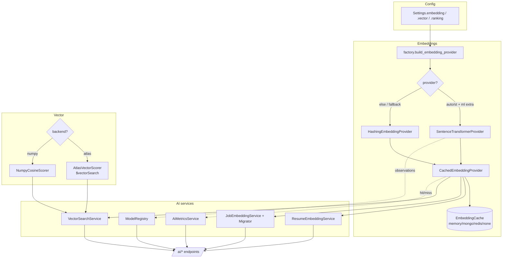
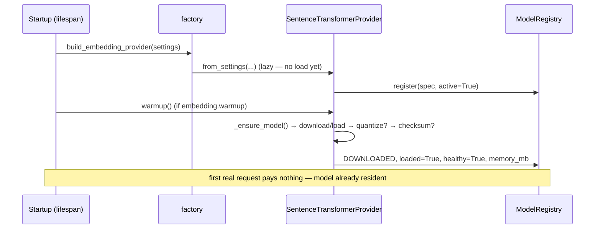
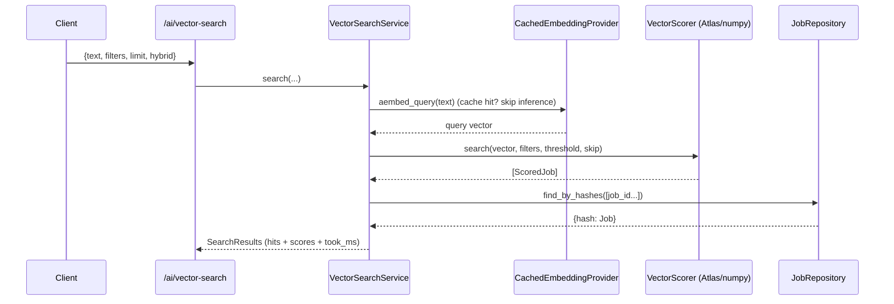

# Production AI Engine (Phase 8)

Phase 8 replaces the deterministic placeholder embedding with a **production-grade
semantic retrieval system** — without changing any business logic. Every new
implementation plugs in behind an existing port (`EmbeddingProvider`,
`VectorScorer`, `RankingEngine`, the Repository pattern). Selection is
configuration; the pipeline, ranking weights, and API contracts are untouched.

## Component map

## What swapped, and behind which port

| Concern | Port (unchanged) | Dev/CI default | Production |
|---|---|---|---|
| Text → vector | `EmbeddingProvider` | `HashingEmbeddingProvider` | `SentenceTransformerProvider` (bge-small) |
| Vector ranking | `VectorScorer` | `NumpyCosineScorer` | `AtlasVectorScorer` (`$vectorSearch`) |
| Caching | `EmbeddingCache` | `MemoryEmbeddingCache` | `MongoEmbeddingCache` (Redis-ready) |
| Ranking | `RankingEngine` | same engine | same engine (+ optional quality weight) |

**Graceful fallback** is the linchpin: when the `ml` extra (torch +
sentence-transformers) is absent — CI, the lean API image — the factory quietly
returns the hashing encoder, so the whole system boots and every test runs with
no model download and no network.

## Model lifecycle

## Request path (semantic search)

## Hybrid ranking (7 factors)

`Overall = 0.40·semantic + 0.20·skill + 0.15·experience + 0.10·location +
0.10·company + 0.05·freshness + 0.00·quality`

Quality is the 7th factor (Phase 8). Its weight defaults to **0.0** so the
composite is byte-for-byte identical to Phase 6 out of the box; raise
`JOBAGENT_RANKING__WEIGHT_QUALITY` (and lower another) to fold posting quality
in. Every component still emits an explanation, and `MatchDetail.narrative` adds
a one-line natural-language summary.

## APIs (all live-boot verified)

`GET /ai/models` · `GET /ai/models/health` · `GET /ai/metrics` ·
`POST /ai/embed` · `POST /ai/rerank` · `POST /ai/vector-search` ·
`POST /ai/skill-gap` · `POST /ai/explain` · `POST /ai/resume/embed`

## Enhancements delivered
Startup warm-up · batch + memory-aware batching · auto model download · checksum
verification · graceful fallback · per-component health endpoint · embedding
migration utility (`EmbeddingMigrator`) · offline embedding CLI
(`job-agent-embed`) · resume embedding diff detection · optional real-embedding
Layer-3 dedup · vector-index validation on startup · optional GPU acceleration
(CUDA auto-detect) · optional int8 quantization · structured AI logs + latency
tracing (via `MetricsSink`).

## Dependency note
`torch` + `sentence-transformers` live in the optional **`ml`** extra and are
**lazy-imported**. The lean API/CI image runs on the hashing encoder. The ST
model-loading code path therefore only executes where the `ml` extra is installed
and a model is available — the one part of Phase 8 not exercised by CI coverage
(analogous to `reportlab` in Phase 7).

See also: [EMBEDDING_PIPELINE.md](EMBEDDING_PIPELINE.md) ·
[VECTOR_SEARCH.md](VECTOR_SEARCH.md) · [MODEL_REGISTRY.md](MODEL_REGISTRY.md).
