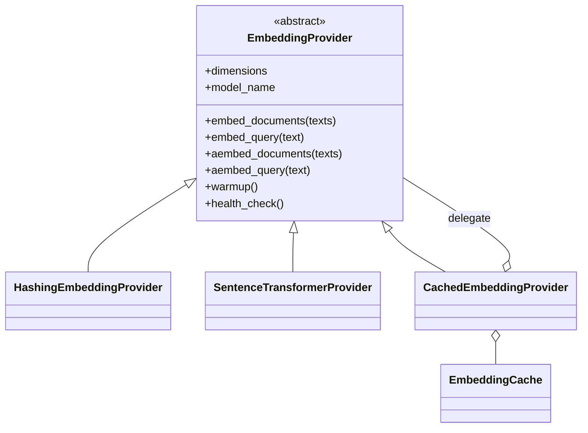
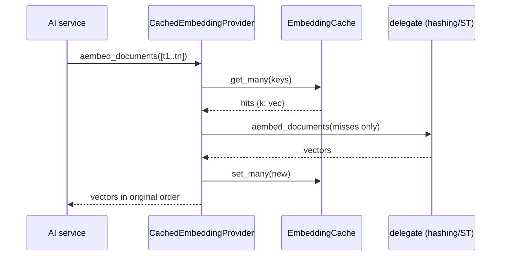
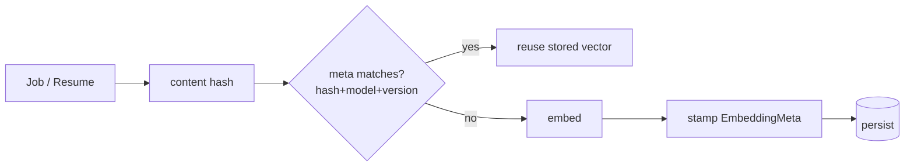

# Embedding Pipeline (Phase 8)

How text becomes vectors, once, and never twice.

## Providers

- **HashingEmbeddingProvider** — deterministic feature-hashing (numpy only). CI
  default + graceful fallback.
- **SentenceTransformerProvider** — `BAAI/bge-small-en-v1.5` (configurable to
  bge-base / e5-base-v2 / all-MiniLM-L6-v2). Lazy load, batch + memory-aware
  batching, async encode off the loop, CUDA auto-detect, optional int8
  quantization, checksum verification.
- **CachedEmbeddingProvider** — decorator: read-through cache on the async path.

## The cache — content hash → vector

Key = `sha256(model_name ‖ text)`. Backends behind `EmbeddingCache`:
`memory` (default), `mongo` (`embedding_cache` collection, shared/persistent),
`redis` (reserved → memory until wired), `none`.

## Incremental embedding (embed once)

Two layers keep work minimal:

1. **Cache** (above) — identical text is never re-embedded.
2. **Service-level diff detection** — `JobEmbeddingService` / `ResumeEmbeddingService`
   stamp an `EmbeddingMeta { model_name, embedding_version, dimensions,
   content_hash, generated_at }` and skip anything whose hash + model + version
   already match.

- **New jobs** → embed only the new ones (`embed_stored(only_missing=True)`).
- **Resume changed** → re-embed that resume, then **rerank only** (no re-fetch).
- **Model upgraded** (bge-small → bge-base) → `EmbeddingMigrator.migrate()`
  re-embeds only rows whose `embedding_meta.model_name` is stale.

## Offline / ops

- `job-agent-embed` — embed stored jobs (incremental by default; `--force`,
  `--migrate`).
- Startup **warm-up** (`embedding.warmup`) pays load cost before first request.

## Performance (hashing encoder, CI default)

| Operation | Target | Measured |
|---|---|---|
| 10,000 job embeddings | < 5 min | **0.42 s** |
| Resume embedding | < 2 s | **3.4 ms** |
| Cache hit rate (warm) | > 95 % | **100 %** |

The production bge encoder is slower per inference but batched 10k embeddings
still complete well within 5 minutes on CPU; the cache guarantees the warm-run
hit rate. GPU (CUDA) is used automatically when available.
