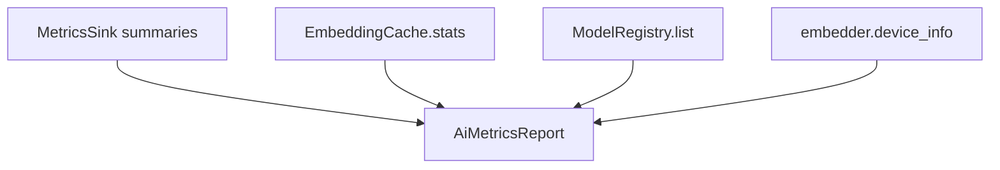

# Model Registry & AI Metrics (Phase 8)

Runtime observability for the AI layer: which models exist, their state, and how
the layer is performing.

## Catalog (static)

`app/ai/catalog.py` — supported models and their specs. Adding a model is a
one-line catalog entry; no other code changes (the provider reads dimensions +
query/document instruction from here).

| Model | Dims | Query prefix |
|---|---|---|
| `BAAI/bge-small-en-v1.5` (default) | 384 | bge instruction |
| `BAAI/bge-base-en-v1.5` | 768 | bge instruction |
| `intfloat/e5-base-v2` | 768 | `query:` / `passage:` |
| `sentence-transformers/all-MiniLM-L6-v2` | 384 | none |

Unknown/custom models are first-class: `spec_for()` synthesises a spec from the
configured vector dimensions.

## Registry (runtime)

`ModelRegistry` is a thread-safe in-process singleton (built once in the DI
container). It is **observation-only** — providers push state to it; it never
imports torch or triggers a model load.

```mermaid
flowchart LR
    P[SentenceTransformerProvider] -->|register/active| R[(ModelRegistry)]
    P -->|DOWNLOADING→DOWNLOADED| R
    P -->|loaded / healthy / memory_mb| R
    P -->|record_inference(count, ms)| R
    R --> M1[GET /ai/models]
    R --> M2[GET /ai/models/health]
    R --> M3[AiMetricsService]
```

Per-model `ModelRecord`: `name · version · dimensions · download_status ·
loaded · healthy · memory_mb · avg_inference_ms · last_inference_ms ·
embedding_count · catalogued`.

## Health

`GET /ai/models/health` reports per-component booleans:
`embedding_model` (a live `health_check` encode of the right dimension),
`embedding_cache` (reachable), `model_registry` (an active model is registered).

## AI metrics

`AiMetricsService` folds four sources into one `AiMetricsReport`:



Fields: `embed_query_ms · embed_documents_ms · embed_batch_ms · vector_search_ms
· rerank_ms · ranking_ms · cache{backend,hits,misses,hit_rate,size} ·
models[] · device{device,cuda_available,gpu_name?}`.

Latencies are recorded as `MetricsSink` summaries (`ai_*_seconds`) by the
provider, `VectorSearchService`, and the reranker — so `/metrics` (Prometheus)
and `/ai/metrics` (structured) share one source of truth. GPU/CPU usage is
reported from the provider's `device_info()` (CUDA auto-detected).

## Migration

`EmbeddingMigrator.migrate()` re-embeds only stored jobs whose
`embedding_meta.model_name` differs from the active model — turning a model
upgrade (e.g. bge-small → bge-base) into a background pass rather than a full
rebuild. `MigrationReport` records `scanned · migrated · from_models{} ·
to_model · took_ms`.
