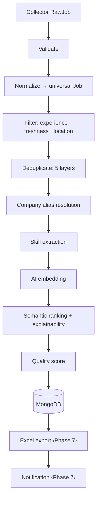

# Job Processing Pipeline (Phase 6)

Transforms raw collector output into production-ready, AI-ranked job records. Every
stage takes an explicit input and returns an explicit output (no shared mutable
state), so stages are independently testable, benchmarked, and — if ever needed —
distributable, without changing business logic.

## Flow

Alias resolution and skill extraction happen *inside* normalization (each Job is
alias-folded and skill-tagged before dedup/rank), and quality is computed during
normalization then refined after dedup — the diagram shows the logical order.

## Universal Job schema (`app/models/job.py`, `schema_version = 3`)

One immutable canonical model every collector normalises into. Key fields:
`company_name` · `canonical_company_name` · `company_aliases` · `ats_type` · `role`
· `normalized_role` · `location` (city/region/country/work_mode/is_remote) ·
`country` · `salary` (min/max/currency/period) · `employment_type` · `experience`
(min/max years + level) · `posted_date` · `url` (apply) · `career_url` ·
`description` · `skills` · `technologies` · `benefits` · `tags` · `schema_version`
· `collector_version` · `source` · `confidence_score` (+ `quality`, `match`,
`embedding`). Additive-only: new optional fields never force a migration.

## Engines

| Concern | Module | Notes |
|---|---|---|
| Normalization | `app/core/normalization/engine.py` | Orchestrates role/location/salary/experience/employment/freshness/skills + alias + hashing; emits a normalization-confidence signal. |
| Role | `normalization/roles.py` | Taxonomy (`data/taxonomies/roles.yaml`, 64 roles) + cleaned fallback. |
| Location | `normalization/location.py` | City aliases (Bengaluru→Bangalore), work mode (WFH→remote), country; 53 cities. |
| Salary | `normalization/salary.py` | ₹/$/€/£, LPA/CTC/lakh/crore/k, ranges, annual/monthly/hourly. Requires a salary signal so experience figures aren't misread. |
| Experience | `normalization/experience.py` | fresher→0, ranges, `N+ years`; maps to `SeniorityLevel`. Year-context anchored. |
| Employment | `normalization/employment.py` | 8 employment types. |
| Freshness | `normalization/freshness.py` | today/yesterday/N-ago, ISO, Unix s/ms, relative. |
| Skills | `app/core/skills/extractor.py` | 202-term taxonomy in 11 categories; whole-token matching. |
| Duplicate detection | `app/core/dedup/detector.py` | 5 layers (below). |
| Ranking | `app/core/ranking/engine.py` | Composite `MatchDetail` + Explainable AI. |
| Skill gap | `app/core/ranking/skill_gap.py` | matched / missing / recommended / learning priority. |
| Quality | `app/core/quality.py` | parser · normalization · duplicate · collector · completeness → overall. |
| Embedding | `app/embeddings/` | `HashingEmbeddingProvider` (numpy) now; bge in Phase 9 behind the same port. |
| Vector | `app/vector/numpy_scorer.py` | Numpy cosine; Atlas `$vectorSearch` swaps in behind `VectorScorer`. |
| Orchestrator | `app/pipeline/pipeline.py` | `JobProcessingPipeline`: process / rank / deduplicate / rerank + per-stage benchmarks + `PipelineRun` history. |

## Duplicate detection — 5 layers (highest precision first)

| Layer | Signal | Confidence |
|---|---|---|
| 1 identity hash | company + role + location + apply URL | 1.00 |
| 5 URL normalize | same posting URL (tracking params stripped) | 0.98 |
| 2 content fingerprint | order-insensitive title+description tokens | 0.95 |
| 4 company alias | same canonical company (Google→Alphabet) + role + location | 0.90 |
| 3 semantic | embedding cosine / token Jaccard ≥ threshold | = score |

Returns a `DuplicateConfidence`; the first layer that fires wins.

## Ranking — composite Overall Score (weights configurable, sum to 1.0)

`0.40 semantic + 0.20 skill + 0.15 experience + 0.10 location + 0.10 company_priority + 0.05 freshness`

`JOBAGENT_RANKING__WEIGHT_*` overrides each weight (validated to sum to 1.0). Every
component carries a plain-language explanation and matched/missing skills
(Explainable AI). **Resume versions**: `ResumeContext.resume_id` scopes each
ranking, so Backend/AI/QA/Data resumes each produce independent rankings; `rerank`
re-scores stored jobs for a new resume without re-fetching postings.

## APIs (`/pipeline`)

| Endpoint | Purpose |
|---|---|
| `POST /pipeline/process` | Full flow: normalise→filter→dedup→embed→rank→(store). |
| `POST /pipeline/rank` | Re-rank stored jobs for a resume (no re-fetch). |
| `POST /pipeline/deduplicate` | De-duplicate a supplied batch. |
| `POST /pipeline/extract-skills` | Categorised skill extraction from text. |
| `GET /pipeline/stats` | Stored-job + last-run stats. |
| `GET /pipeline/history` | Recent pipeline runs (per-stage benchmarks). |

## Performance

10,000 synthetic jobs process end-to-end in **~3 seconds** (~3,300 jobs/s) —
well under the 3-minute target. Each stage is independently benchmarked on the
`PipelineRun.stages` record; normalization dominates, everything else is sub-second.

## Embedding note (Phase 9 swap)

Ranking runs today on `HashingEmbeddingProvider` (deterministic, numpy-only) so the
whole pipeline is testable without heavy ML deps. The production
`BAAI/bge-small-en-v1.5` encoder and Atlas `$vectorSearch` plug in behind the
existing `EmbeddingProvider` / `VectorScorer` ports (a config change, per ADR-001)
and require the optional `ml` extra. Dimensionality is 384 in both.
