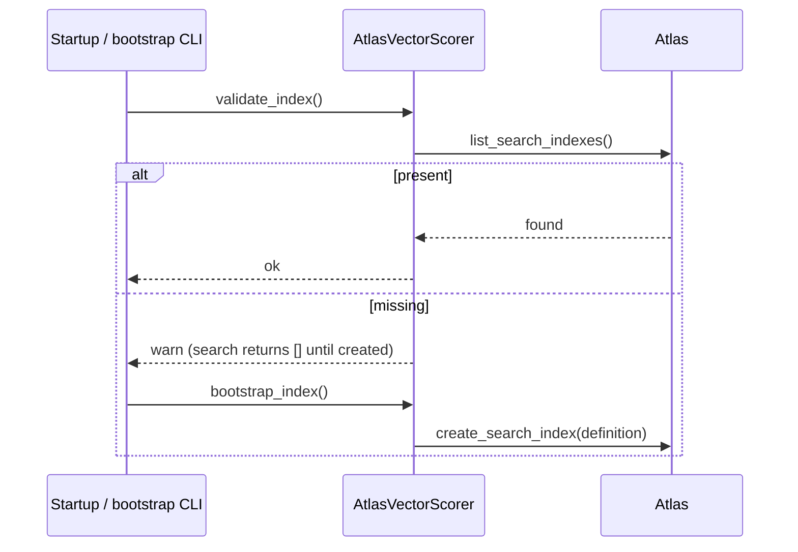

# Vector Search (Phase 8)

Production semantic retrieval on **MongoDB Atlas Vector Search** — no FAISS.
Same `VectorScorer` port as the local numpy backend, so they are interchangeable
(`settings.vector.backend`).

## Backends

| Backend | Class | Use |
|---|---|---|
| `atlas` | `AtlasVectorScorer` | production `$vectorSearch` on `jobs.embedding` |
| `numpy` | `NumpyCosineScorer` | dev / CI / tests (in-memory cosine) |

Both honour the same call: `search(query_vector, *, limit, filters,
score_threshold, skip)`.

## Atlas pipeline

`build_search_pipeline()` is a **pure function** (unit-tested without a live
cluster) that emits:

```
$vectorSearch { index, path, queryVector, numCandidates≥(skip+limit)·2, limit,
                filter? }
$project      { job_id: "$job_hash", score: {$meta: "vectorSearchScore"} }
$match        { score: {$gte: threshold} }     # if threshold > 0
$skip N                                          # pagination
$limit N
```

Capabilities: similarity search · top-k · metadata filters (`status`,
`work_mode`, `location_tags`) · score threshold · pagination · hybrid search.

## Hybrid search

```mermaid
flowchart LR
    Q[query] --> V[vector leg\n$vectorSearch]
    Q --> L[lexical leg\n$text index]
    V --> N1[min-max normalise]
    L --> N2[min-max normalise]
    N1 --> B[blend: α·sem + (1-α)·lex]
    N2 --> B
    B --> R[ranked job_ids]
```

`alpha` (default `0.6`) weights the semantic side. Each leg is min-max
normalised before blending so neither dominates by raw scale. Empty query text
degrades to pure vector search.

## Index lifecycle



- Index definition (dimensions + `cosine` + filter fields) is the single source
  of truth, kept in lock-step with `settings.vector`.
- Startup **validation** logs a warning if the index is missing (never blocks
  boot). `job-agent-bootstrap --with-vector-index` creates it.
- All search errors are caught and return `[]` — a search failure never crashes
  a request.

## VectorSearchService

`embed query → scorer.search → hydrate jobs by job_hash → page`. Returns
`SearchResults { query, total, limit, skip, took_ms, hits[{job_id, score, job}] }`
and records `ai_vector_search_seconds`.

## Performance

| Operation | Target | Measured (numpy, 10k corpus) |
|---|---|---|
| Vector search | < 200 ms | **19 ms** |
| Rerank 10,000 jobs | < 500 ms | **≈470 ms** |

Atlas ANN search is sub-200 ms at far larger corpora; numpy is the CI proxy.
